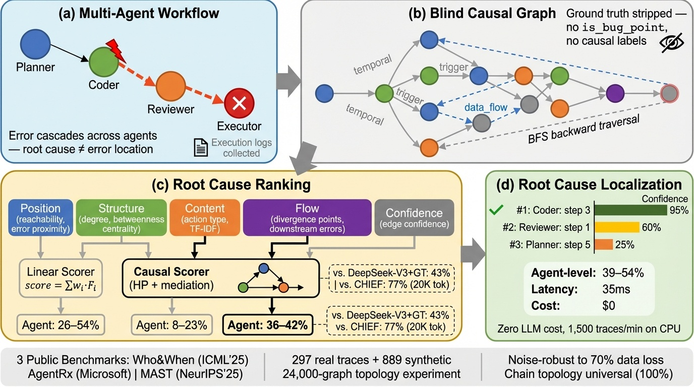

# AgentTrace

**Zero-inference failure localization for multi-agent LLM systems.**

[](https://arxiv.org/abs/2603.14688)
[](LICENSE)
[](https://www.python.org/downloads/)

AgentTrace reconstructs a causal graph from a multi-agent execution log and ranks the steps and
agents most likely to have caused a failure. It makes **no LLM calls at diagnosis time**, runs on
CPU in tens of milliseconds per trace, and costs nothing to run. Use it as a first-pass triage
before you spend an LLM budget, not as a replacement for one.

<p align="center">
  
</p>

## Install

```bash
git clone https://github.com/GeoffreyWang1117/AgentTrace.git
cd AgentTrace
pip install -e ".[dev]"      # add ".[llm]" for the optional LLM baselines
python demo.py               # 5-agent trace with a planted bug, ranked in ~1 ms
pytest -q                    # 51 tests
```

## Use

```python
from agenttrace.core.graph import CausalGraph
from agenttrace.core.node import Node, NodeType
from agenttrace.ranking.ranker import ImprovedAgentTrace

graph = CausalGraph(run_id="my_run")
# add one Node per agent step (agent_id, content, timestamp, parent_ids) ...
# then rank root-cause candidates for the failing node
```

`demo.py` is the complete runnable example. The CLI (`agenttrace demo | analyze <trace.json> |
serve`) wraps the same pipeline. Adapters for public failure-attribution benchmarks
(Who&When, AgentRx, MAST, TRAIL, TraceElephant) are in `experiments/adapters/`.

## Layout

| path | contents |
|---|---|
| `agenttrace/core` | graph, node, and edge types |
| `agenttrace/inference` | edge inference: temporal, data-flow, optional semantic (sentence-embedding) edges |
| `agenttrace/ranking`, `agenttrace/causal` | structural scorers and the counterfactual (SCM) scorer |
| `agenttrace/hooks`, `tracer.py` | decorators for capturing traces from a live system |
| `experiments/adapters` | benchmark loaders |
| `experiments/baselines` | position, LLM-direct, CoT, ReAct, GNN, causal-discovery baselines |
| `data/` | the synthetic benchmark and results of the workshop paper |

## What to expect: known limitations

These findings came out of evaluating AgentTrace on public benchmarks after the workshop paper
was published. Please read them before you rely on the tool.

- **Chain-shaped traces.** When a trace is a single chain (as in most current frameworks'
  logs), every upstream step is a cut vertex, so the counterfactual responsibility score is
  identical for all candidates and cannot discriminate between them. The ranking then falls back to
  structural features. Ties are broken deterministically by node id, so a tie is still a tie:
  treat the top-1 answer on a fully tied chain as no better than picking a node uniformly at random.
- **Accuracy vs. a frontier LLM.** On public benchmarks, agent-level Hit@1 is about 39% on
  Who&When and 54% on AgentRx. A frontier LLM (DeepSeek-V4-Pro, all-at-once prompting)
  reaches about 64% on Who&When, at roughly $0.01 and 20 s per trace. AgentTrace trades that
  accuracy gap for zero cost and millisecond latency.
- **Semantic edges are benchmark-dependent.** The optional semantic edges help on some benchmarks
  and hurt substantially on others. Validate them on your own traces before enabling them by default.

## Reproducing the workshop paper

The exact artifact cited by arXiv:2603.14688 (ICLR 2026 Workshop on Agents in the Wild) is
preserved at tag
[`iclr2026-aiwild-camera-ready`](https://github.com/GeoffreyWang1117/AgentTrace/tree/iclr2026-aiwild-camera-ready):

```bash
git checkout iclr2026-aiwild-camera-ready
python -m experiments.scripts.run_paper_experiments
```

`main` has since changed. Scorer ties are now resolved deterministically, and the benchmark
adapters have been corrected, including TRAIL ground-truth resolution. Some benchmark numbers
in the workshop paper are therefore superseded, in particular the comparisons against LLM-based
attribution. Treat the tag as the record of what that paper ran, and `main` as the current tool.

## Citation

```bibtex
@article{wang2026agenttrace,
  title   = {AgentTrace: Causal Graph Tracing for Root Cause Analysis in Deployed Multi-Agent Systems},
  author  = {Wang, Zhaohui Geoffrey},
  journal = {arXiv preprint arXiv:2603.14688},
  year    = {2026},
  note    = {ICLR 2026 Workshop on Agents in the Wild}
}
```

## License

Apache 2.0. Benchmark data loaded by the adapters is **not** redistributed here. Obtain each
benchmark from its original release, under its own license.
